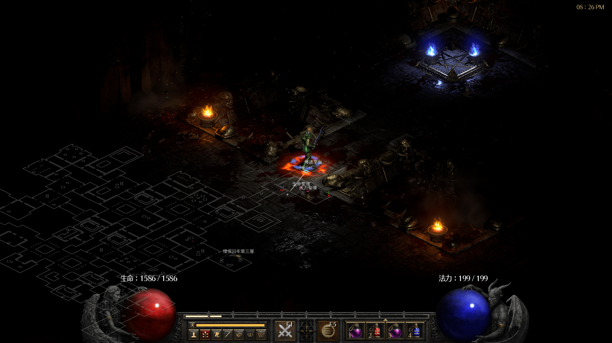
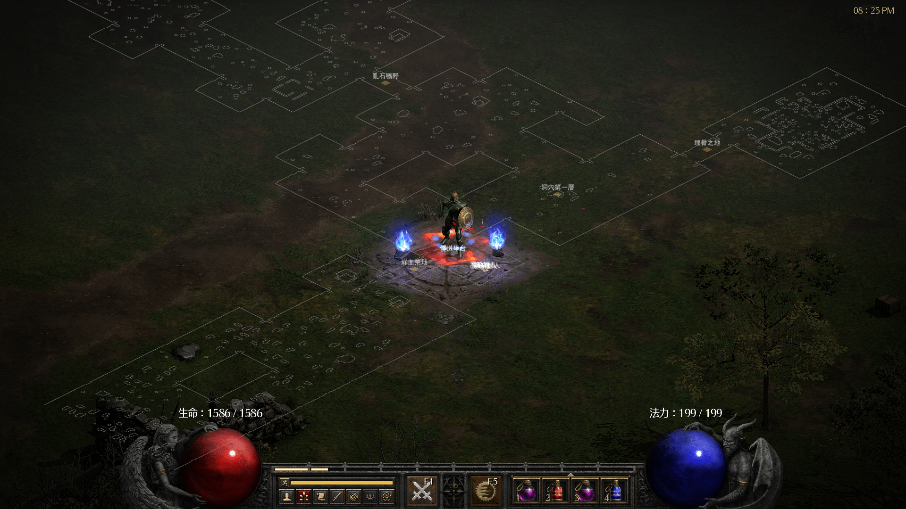
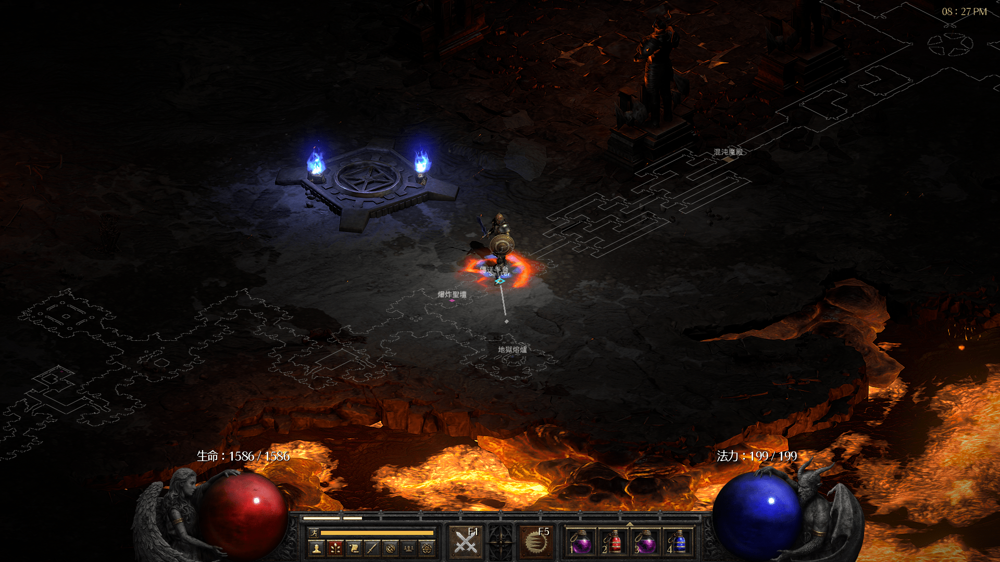

**README in other languages: [English](../../README.md)**

# D2RMH
Diablo II Resurrected 开图工具

# 免责声明
**D2RMH只从D2R读取内存，并没有注入代码、使用代码钩子以及写入内存，  
但并不保证完全不会被封号，使用中出现任何问题概不负责。**  

# 版本更新
请看 [ChangeLog](../../doc/ChangeLog.md)

# 需求依赖
* 本工具需要暗黑2 1.13c版本，你可以由此[HERE](https://archive.org/details/diablo-ii-1.13c-minimal.-7z)下载最精简版的1.13c

# 使用
1. 从 `Releases` 里下载最新的发布版，或从 `Actions` 里下载最新的快照编译版(你需要登录GitHub) 
2. 修改 D2RMH.ini(中文用户可以使用contrib/D2RMH_CN.ini的内容作为默认设置), 设置 `d2_path` 为你的D2 1.13c目录，也可以直接把`D2MRH.exe`和所有`*.ini`放到D2 1.13c目录里去
3. 运行 D2RMH.exe

# Screenshots

# 插件系统
* 插件加载自 `plugins` 目录里的所有 `.lua` 文件
* 如果想自己写插件请阅读 [文档](../../doc/Plugin.md)

# TODO
请看 [TODO](../../doc/TODO.md)

# 如何编译
## 快速指引
* 使用 [cmake](https://www.cmake.org/) 来编译, 支持 Visual Studio 2019/2022 和 MinGW GCC 32bit 9.0+(建议用MSYS2安装)
* 对于Visual Studio 2019/2022: 在cmake命令行中添加`-A Win32`以确保编译出的是32位的exe
## 详细教程
### MinGW GCC 32bit
* 安装MSYS2(https://www.msys2.org), 打开MSYS2.exe，输入`pacman -Syu --noconfirm && pacman -S --noconfirm --needed make git mingw-w64-i686-toolchain mingw-w64-i686-cmake`安装必须的依赖组件
* 关闭MSYS2命令行，用MINGW32.exe打开一个新命令行
* 克隆D2RMH的源代码： `git clone https://github.com/soarqin/D2RMH`
* 输入 `cd D2RMH && cmake -Bbuild -G "Unix Makefiles" -DCMAKE_BUILD_TYPE=Release -DUSE_STATIC_CRT=ON`
* 然后 `make -Cbuild` 后你就可以在 `build/bin` 目录得到编译好的exe
* (可选) 你可以进一步输入`strip build/bin/D2RMH.exe`将符号定义从exe里去掉以缩减exe的大小
### Microsoft Visual Studio 2019/2022
* 安装Visual Studio 2019或2022社区版(或者你有专业/企业版也可以)
* 解压下载的源代码文件，或者用git来clone仓库: `git clone https://github.com/soarqin/D2RMH` 注意: 你需要 [Git for windows](https://git-scm.com/download/win)
* (Visual Studio 2019) 输入 `cmake -Bbuild -G "Visual Studio 16 2019" -A Win32 -DUSE_STATIC_CRT=ON`  
  (Visual Studio 2022) 输入 `cmake -Bbuild -G "Visual Studio 17 2022" -A Win32 -DUSE_STATIC_CRT=ON`
* 然后你可以二选一:
    * 输入 `cmake --build build --config Release` 直接编译
    * 打开生成的 `D2RMH.sln` 进行编译
* 编译好的exe文件在 `build\bin` 目录里

# 鸣谢
* 核心函数来自 [d2mapapi](https://github.com/jcageman/d2mapapi).
* 想法以及内存地址来自 [MapAssist](https://github.com/misterokaygo/MapAssist).
* [Handmade Math](https://github.com/HandmadeMath/Handmade-Math) 处理向量和矩阵运算
* [glad](https://glad.dav1d.de) 加载 OpenGL(Core)/WGL 函数
* [inih](https://github.com/benhoyt/inih) 读取 ini 文件
* [JSON for Modern C++](https://github.com/nlohmann/json) 读取 JSON 文件
* [CascLib](https://github.com/ladislav-zezula/CascLib) 从D2R读取Casc存储
* [stb](https://github.com/nothings/stb), 使用了stb_truetype和stb_rect_pack
